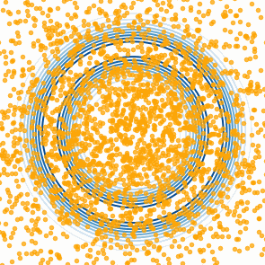

# iterative-gaussianization



This repository contains the code for reproducing the experiments in *Rotated Mean-Field Variational Inference and Iterative Gaussianization*.

The algorithm constructs a transport map that iteratively pushes a target distribution toward a standard Gaussian. Each iteration alternates between two steps:

- **Relative score PCA**: Compute the principal components of a cross-covariance matrix involving the target's score to determine the rotation;
- **MFVI**: Perform mean-field variational inference for the rotated target to obtain a coordinatewise transformation.

## Installation
```
pip install -e .
```

## Run experiments
```
python -m experiments.logistic.run_logistic
python -m experiments.posteriordb_experiment.run_posteriordb --posterior_name normal_mixture
python -m experiments.glmm.run_glmm
python -m experiments.sparselogistic.run_sparse_logistic
python -m experiments.irt2pl.run_irt2pl
```