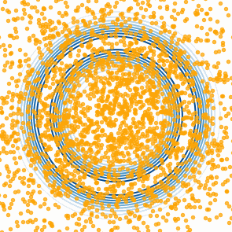
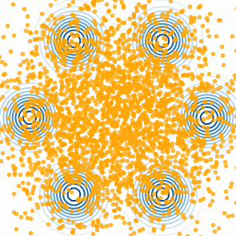

# iterative-gaussianization





## Installation
```
pip install -e .
```

## Run experiments
```
python -m experiments.logistic.run_logistic
python -m experiments.posteriordb_experiment.run_posteriordb --posterior_name normal_mixture
python -m experiments.sparselogistic.run_sparse_logistic
python -m experiments.irt2pl.run_irt2pl
```